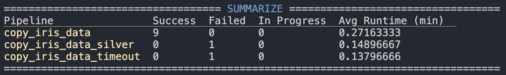

# mario

an azure pipeline monitoring tool inspired by lazygit

## commands

---

### summarize

print a summary of pipeline runs for the last n days. Optionally filter by pipeline substring

```bash

mario summarize --days [nDays] --name [pipeline]
```



---

### compare

compare two pipelines and print differences if they exist

```bash
mario compare --name1 [pipeline1] --name2 [pipeline2]
```


